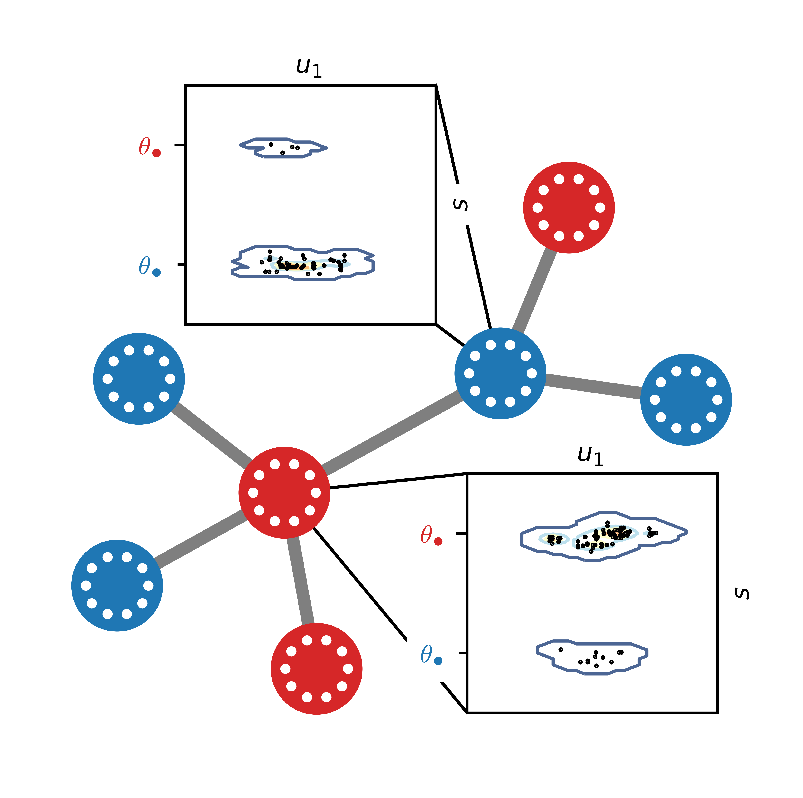

# ABMEv.jl
<!-- [](https://vboussange.github.io/ABMEv.jl/stable) -->
<!-- For now we only direct to dev documentation. In the future, one will need to deploy a ssh key to and use TagBot. -->
[](https://vboussange.github.io/ABMEv.jl/dev)
[](https://gitlab.ethz.ch/bvictor/abmev/-/commits/master)
[](https://gitlab.ethz.ch/bvictor/abmev/-/commits/master)

<div align="center"> </img> </div>

This is a suite for simulating an Agent Based Model that captures the evolutionary dynamics of a population in a multidimensional space.

## Installation
```julia
using Pkg;
Pkg.add("https://gitlab.ethz.ch/bvictor/abmev.git")
```
This will download latest version from git repo and download all dependencies.
To check out from an other branch than master, one has to do the trick
```julia
using Pkg;
Pkg.add("ABMEv#no_C_matrix")
```
## Getting started
```julia
using ABMEv
```
