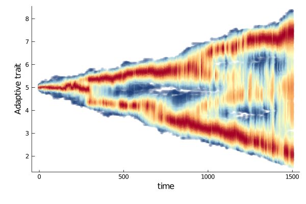

# Environmental Gradient

In this tutorial, we model agents evolving on a discrete segment, where each patch favours an optimal adaptive trait, along a gradient. This is typically the case along an altitudinal gradient.

Here is what the geographical space looks like.


Every colour stands for a different optimal trait.

## Run the world
```julia
using Revise,ABMEv,Plots,UnPack


nodes = 9
dim_neutr = 30
geospace = DiscreteSegment(Int8(1),Int8(nodes))
adaptivespace = RealSpace{1,Float16}()
myspace = (geospace,adaptivespace)
sigma_K = 1.;
sigma_a = .8;
K0 = 1000;
mu = [1.,1.]
a = 1
b(X,t) = gaussian(X[2],X[1] * a,sigma_K) / nodes
d(X,Y,t) =  (X[1] ≈ Y[1]) * gaussian(X[2],Y[2],sigma_a) / K0
NMax = 2000
D = (5e-1,5e-2)
# tend = 1.5
tend = 1500
p = Dict{String,Any}();@pack! p = d,b,NMax,mu,D

myagents = [Agent(myspace,(Int8(5),Float16(5) + Float16(5e-2) * randn(Float16),),ancestors=true,rates=true) for i in 1:round(K0/nodes)]

w0 = World(myagents,myspace,p,0.)

s = run!(w0,Gillepsie(),tend,dt_saving=5);
Plots.plot(s, ylabel = "Adaptive trait",trait=2)
```


## Animated trait space
Here we show how to plot a cool animated scatter plot of the trait space through time.

```julia

```


## [Plotting lineages](@id lineages)
A cool feature of ABMEv.jl is its ability to track agents ancestors traits (cf [Agent section](../manual/agent.md))

On can plot it, to get an idea of the coalescence of the population.


Beautiful, isn't it?

!!! tip "Making sense of trait histories"
    Some metrics are available (cf  [Metrics section](../manual/metrics.md)) that summarize the divergence in trait value (or geographical position) through time).
